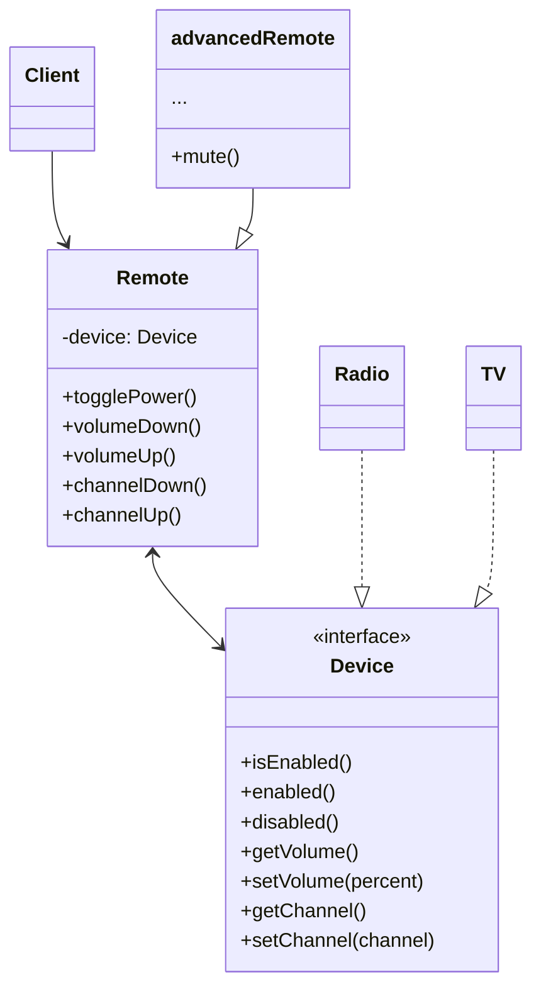

# Inhalt 

- [Problem](#problem)
- [Lösung](#lösung)
- [UML Diagram](#uml-diagram)
- [Vorteile, Nachteile](#vorteile-nachteile)
  
---

# Problem
Nehmen wir an, Sie haben eine geometrische Klasse Shape mit zwei Unterklassen: Kreis und Quadrat. Sie möchten diese Klassenhierarchie erweitern, um Farben einzubeziehen, also planen Sie, rote und blaue Unterklassen für Shapes zu erstellen. Da Sie jedoch bereits zwei Unterklassen haben, müssen Sie vier Klassenkombinationen wie BlueCircle und RedSquare erstellen.

Wenn Sie der Hierarchie neue Formtypen und Farben hinzufügen, wächst sie exponentiell. Um zum Beispiel eine Dreiecksform hinzuzufügen, müssten Sie zwei Unterklassen einführen, eine für jede Farbe. Und danach würde das Hinzufügen einer neuen Farbe die Erstellung von drei Unterklassen erfordern, eine für jeden Formtyp. Je weiter wir gehen, desto schlimmer wird es.

# Lösung
Dieses Problem tritt auf, weil wir versuchen, die Shape-Klassen in zwei unabhängigen Dimensionen zu erweitern: nach Form und nach Farbe. Das ist ein sehr häufiges Problem bei der Klassenvererbung.

Das Bridge-Muster versucht, dieses Problem zu lösen, indem es von der Vererbung zur Objektkomposition übergeht. Das bedeutet, dass Sie eine der Dimensionen in eine separate Klassenhierarchie extrahieren, so dass die ursprünglichen Klassen auf ein Objekt der neuen Hierarchie verweisen, anstatt alle Zustände und Verhaltensweisen in einer Klasse zu haben.

Nach diesem Ansatz können wir den farbbezogenen Code in eine eigene Klasse mit zwei Unterklassen auslagern: Rot und Blau. Die Klasse Shape erhält dann ein Referenzfeld, das auf eines der Farbobjekte verweist. Nun kann die Form alle farbbezogenen Aufgaben an das verknüpfte Farbobjekt delegieren. Diese Referenz dient als Brücke zwischen den Klassen Shape und Color. Von nun an ist es für das Hinzufügen neuer Farben nicht mehr erforderlich, die Shape-Hierarchie zu ändern, und umgekehrt.

# UML Diagram

# Vorteile, Nachteile 

## Vorteile
- Sie können plattformunabhängige Klassen und Anwendungen erstellen.
- Der Code arbeitet mit High-Level-Abstraktionen. Er ist nicht den Details der Plattform ausgesetzt.
- Offen/Geschlossen-Prinzip. Sie können neue Abstraktionen und Implementierungen unabhängig voneinander einführen.

## Nachteile
- Sie können den Code komplizierter machen, indem Sie das Muster auf eine sehr komplizierte Klassenstruktur anwenden.