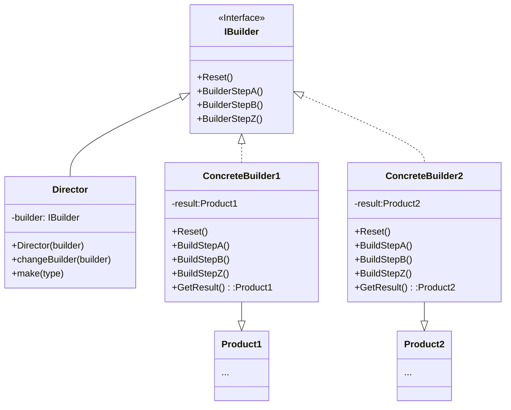

# Inhalt 

- [Problem](#problem)
- [Lösung](#lösung)
- [UML Diagram](#uml-diagram)
- [Vorteile, Nachteile](#vorteile-nachteile)
  
---

# Problem
Stellen Sie sich ein komplexes Objekt vor, das eine mühsame, schrittweise Initialisierung vieler Felder und verschachtelter Objekte erfordert. Ein solcher Initialisierungscode ist normalerweise in einem monströsen Konstruktor mit vielen Parametern vergraben. 

Nehmen wir an wir bauen ein Haus. Natürlich hat jedes Haus Wände, Fenster, Böden und Türen, sprich wir haben 4 Eigenschaften. Nun möchte jeamand ein Haus mit Garten, Terasse, Pool und einem Springbrunnen. Unser Haus wird mit weiteren 4 Eigenschaften erweitert. Man sieht man hat nun 8 Eigenschaften die ein einem Konstrukter übergeben werden müssen, auch wenn jemand nur ein Basis Haus wünscht.

Als Beispiel: new House(4,3, 2, 1, null, null, null, null,  ...)

# Lösung
Das Builder-Pattern schlägt vor, den Objekkonstruktorcode aus seiner eignene Klasse zu extrahieren und diese in ein separates Object zu verschieben. Diese wird dann Builder genannt.

Das Builder-Pattern gliedert die Objektkonstruktion in eine Reihe von Schritten (buildWalls, buildDoor usw.). Um ein Objekt zu erstellen, führen Sie eine Reihe dieser Schritte an einem Builder-Objekt aus. Wichtig dabei ist, dass Sie **nicht alle** Schritte aufrufen müssen. Sie können nur die Schritte aufrufen, die für die Erstellung einer bestimmten Konfiguration eines Objekts erforderlich sind.

### Director (Optional)
Sie können noch weiter gehen und eine Reihe von Aufrufen der Builder-Schritte, die Sie zur Konstruktion eines Produkts verwenden, in eine separate Klasse namens director extrahieren. Die director-Klasse legt die Reihenfolge fest, in der die Bauschritte ausgeführt werden sollen, während der Builder die Implementierung dieser Schritte bereitstellt.

# UML Diagram

# Vorteile, Nachteile 

## Vorteile
- Sie können Objekte Schritt für Schritt konstruieren, Konstruktionsschritte aufschieben oder Schritte rekursiv ausführen.
- Sie können denselben Konstruktionscode wiederverwenden, wenn Sie verschiedene Darstellungen von Produkten erstellen.

## Nachteile
- Die Gesamtkomplexität des Codes nimmt zu, da das Pattern die Erstellung mehrerer neuer Klassen erfordert.
