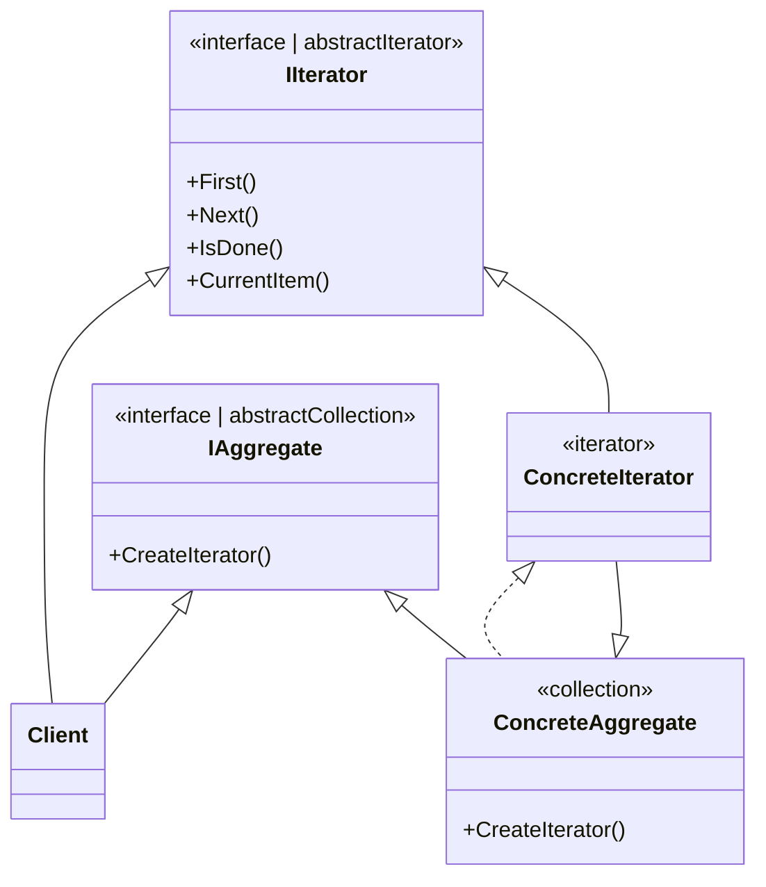

# Inhalt 

- [Problem](#problem)
- [Lösung](#lösung)
- [UML Diagram](#uml-diagram)
- [Vorteile, Nachteile](#vorteile-nachteile)
  
---

# Problem
Collections sind einer der häufigsten verwendeten Datentypen in der Programmierun. 
Nichtsdesotrotz ist eine Sammlung nur ein Container für eine Gruppe von Objekten. Die meisten Sammlungen speichern 
ihre Elemente in eingachen Listen. Einige von ihnen basieren jedoch auf Stacks, Trees, Graphs und anderen komplexen Datenstrukturen.

Aber egal wie eine Sammlung strukturiert ist, sie muss eine Möglichkeit bieten, auf ihre Elemente zuzugreifen, damit andere Codes 
diese Elemente verwenden können. Es solle eine Möglichkeit geben, die einzelnen Elemente der Sammlung zu druchlaufen,
ohne immer wieder auf die selben Elemente zuzugreifen.

Bei einer Collection, die auf einer Liste basiert, mag das einfach klingen. Sie durchlaufen einfach eine Schleife über alle Elemente.
Aber wie durchläuft man sequentiell die Elemente einer komplexen Datenstruktur wie dies eines Trees. An einem Tag kann 
man mit Traversieren in die Tiefe eines Trees gehen, aber am nächsten Tag möchte man in die Breite Traversieren oder einen 
zufälligen Zugriff auf die Baumelemente ausführen.
Das Hinzufügen von immer mehr Traversierungs-Algorithmen zur Collection verwischt allmäglich die Hauptaufgabe, 
nämlich die effiziente Datenspeicherung.

# Lösung
Die Hauptidee des Iterator pattern besteht darin, das Durchlaufverhalten einer Collection in ein seperates
Objekt zu extrahieren, das als Iterator bezeichnet wird.

# UML Diagram

# Vorteile, Nachteile 

## Vorteile
- Dadurch, dass man die Traversale-Algorithmen in verschiedenen Klassen auslagern kann, ist die Single Responsibility Principle gegeben.
- Man kann neue Typen von Collection und Iterationen implementieren und sie an bestehenden Code übergeben, ohne etwas zu ändern.
- Man kann über die selbe Collection parallel iterieren, da jedes Iterationsobjekt seinen eigenen Iterationsstauts entählt.
- Aus dem selben Grund kann man eine Iteration verzögern und sie bei Bedarf fortsetzen.

## Nachteile
- Das Anweden dieses Patterns kann ein Overkill sein, wenn die Anwendung mit einer einfachen Collection arbeitet.
- Ein Iterator kann in einigen Situation ineffizient sein, als das direkte Durchgehen von Elementen einiger spezialisierten Collection.