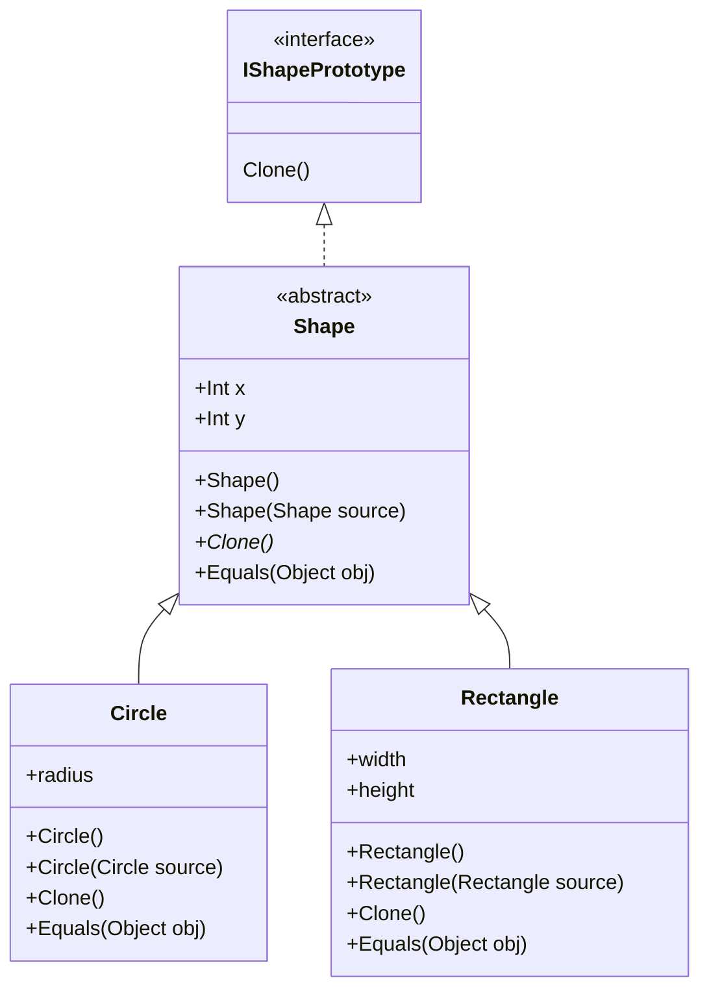

# Inhalt 

- [Problem](#problem)
- [Lösung](#lösung)
- [UML Diagram](#uml-diagram)
- [Vorteile, Nachteile](#vorteile-nachteile)
  
---

# Problem
Wenn man ein neues Objekt erstellen möchte, erzeugt man meist zuerst ein neues Objekt der selben Klasse
Anschliessend werden alle Werte der Felder des originals in das neu erzeugte Objekt kopiert.

Das Problem bei dieser Lösung ist, was macht man, wenn die Felder privat sind und auf diese nicht zugegriffen werden
kann. Es gibt noch ein weitere Probleme. Um das Objekt zu kopieren muss überall die Objekt-Klasse bekannt sein was
zu vielen Abhängigkeiten führt. Manchmal ist nur das Interface bekannt, das die Klasse implementiert, aber nicht die
konkrete Klasse zum Beispiel, wenn ein Parameter in einer Methode ein Objekt akzeptiert, das ein bestimmtes
Interface implementiert.

# Lösung
Das Prototypen-Pattern löst dieses Problem, indem es den Klonungsprozess zum zu klonenden Objekt delegiert. Das
Pattern deklariert ein allgemeines Interface, für alle Objekte, welches das Klonen unterstützt. Üblicher weise
enthält ein solches Interface nur eine Methode für das Klonen. 

Die eigentliche Implementierung der Methode in den verschiedenen Klassen ist meistens recht ähnlich. Es wird durch
einen Konstruktor neues Objekt erzeugt diesem Konstruktor wird das zu klonende Objekt übergeben. Der Konstruktor
initialisiert beim erzeugen des neuen Objektes alle Felder mit den Werten des zu klonenden Objektes.

Ein Objekt, das Klonen unterstützt, wird meistens als Prototyp bezeichnet.

# UML Diagram

# Vorteile, Nachteile 

## Vorteile
- Klonen von Objekten ohne die konkreten Klassen zu koppeln.
- Repetitiven Initialisierungs-Code vermeiden durch klonen von vorinitialisierten Prototypen.
- Komplexere Objekte können einfacher erzeugt werden. 
- Alternative zu Vererbung bei Konfigurations-Presets bei komplexen Objekten. 

## Nachteile
- Klonen von komplexen Objekten mit zirkulären Referenzen ist recht kompliziert.
